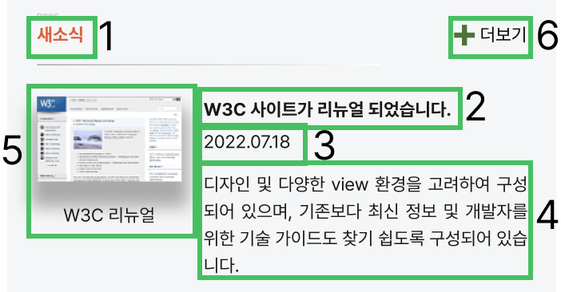
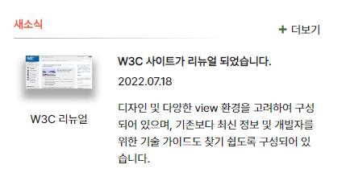

# mission-3 Transition
## 💻 Html
1. 마크업 순서  
    1. section.newsContainer
    2. h2.newsTitle
    3. div.boardTitle > h3.boardTitle + p.boardTime + p.boardDetail
    4. figure.boardImg > img + figcaption
    5. a.newsLink
<br>
🔻 제가 생각한 논리적인 순서는 이렇습니다.
<br>


해당 section의 제목(h2) '새소식' 을 먼저 마크업하고 게시판 글에 대한 제목과, 작성일, 내용을 보여주고 미리보기 이미지를 마크업하였습니다.
그리고 사용자가 해당 내용을 확인한 후 더 많은 소식을 보고싶을 때 더보기 버튼을 누를 수 있도록 가장 마지막에 마크업하였습니다.
<br>

<br>
<br>

## 💻 CSS
⚒️ 참고 width, height, padding, margin, color, font-family, font-size, font-weight, line-height 는 전부 Figma 시안대로 했습니다.
<br>
<br>

```
/* 새소식 전체 영역 */
.newsContainer {
  position: relative;
}

/* 더보기 */
.newsLink {
  position: absolute;
  top: 0;
  right: 0;
}
```
가장 마지막에 마크업한 더보기를 가장 윗상단 오른쪽에 배치하기 위해 전체영역에 position 값을 주었습니다.

<br>
<br>

```
/* 구분선 */
.newsTitle::after {
  grid-area: line;
  content: "";
  display: block;
  width: 266px;
  height: 1px;
  background: linear-gradient(90deg, #A9A9A9 -1.32%, #FFFFFF 100%);
  margin: 6px 0;
}
```
새소식과 게시판 영역 사이에 border을 주기 위해 가상요소를 만들었고 그라디언트 효과를 넣어 끝으로 갈수록 안보이게 설정하였습니다.
<br>
<br>

```
/* 게시판 전체 영역 */
.newsBoard {
  display: grid;
  grid-template-columns: repeat(2, 1fr);
  grid-template-rows: auto;
  grid-template-areas:
    "img subtitle"
    "img date"
    "img detail";
}

.boardTitle { grid-area: subtitle; }

.boardTime { grid-area: date; }

.boardDetail { grid-area: detail; }

.boardImg { grid-area: img; }
```
게시판 영역을 그리드로 정렬하기 위해 display:grid값을 주었습니다. 그러고 편한 정렬을 위해 각 태그들에 grid-area 를 정의하여 태그 이름만 봐도 알 수 있도록 grid 정렬을 하였습니다.
<br>
<br>

## 완성샷

<br>
<br>

