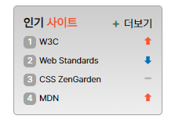

# mission-3 Transition
## 💻 Html
1. 마크업 순서  
    1. section.favoriteSite
    2. h2.fsTitle
    3. ol.fsList > a > .linkNum
    4. a.fs__more > span.plus
<br>
🔻 제가 생각한 논리적인 순서는 이렇습니다.
<br>

논리적인 순서로 인기사이트 제목이 먼저 오고 그 다음 순위가 나오게 했습니다.  
그리고 순위는 순서가 있는 리스트 이기 때문에 ```ol``` 태그로 마크업하였고 사용자의 입장에서 순위를 다 보고 난 후 다른 결과가 보고싶어지면 더보기 할 수 있도록 더보기를 가장 마지막에 마크업하였습니다.
<br>

<br>
<br>

## 💻 CSS
⚒️ 참고 width, height, padding, margin, color, font-family, font-size, font-weight, line-height 는 전부 Figma 시안대로 했습니다.
<br>
<br>

```
:root {
  --primary-color: #181818;
  --accent-color: #ED552F;
  --plus-color: #447231;
  --num-color: #A3A3A3;
}
```

변수를 사용하여 색깔 지정하는 것을 연습하기 위해 작성했습니다.

<br>
<br>

```
/* 리스트 전체 */
.fsListWrapper {
  display: flex;
  flex-flow: column nowrap;
  gap: 8px;
}
```
ol태그에 ```display: flex```를 주어 자식 요소들을 열 방향으로 나열하고 자식 요소들의 간격을 8px씩 떨어지게 했습니다.
<br>
<br>

```
/* 리스트 */
.fsList {
  background: url(./images/rank.png) no-repeat;
  width: 100%;
  list-style-type: none;
}

/* 1등 리스트 */
.list__W3C {
  background-position: 154px 1px;
}

/* 2등 리스트 */
.list__Web {
  background-position: 154px -43px;
}

/* 3등 리스트 */
.list__CSS {
  background-position: 154px -21px;
}

/* 4등 리스트 */
.list__MDN {
  background-position: 154px 1px;
}
```
리스트의 가장 오른쪽에 배경이미지를 삽입 한 후 스프라이트 기법을 활용하여 위치를 조정해서 원하는 아이콘이 나올 수 있도록 하였습니다.

<br>
<br>

```
/* list-style */
.linkNum {
  display: inline-block;
  width: 16px;
  height: 16px;
  font-size: 11px;
  text-align: center;
  line-height: 16px;
  background: var(--num-color);
  color: #fff;
  border-radius: 5px;
  margin-right: 4px;
}
```
```list-style```을 변경하기 위해 ```none```을 지정한 후 위와 같이 속성값을 추가했습니다.

<br>
<br>

## 완성샷

<br>
<br>

